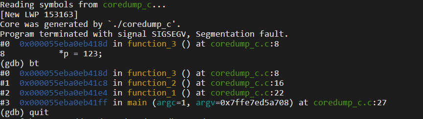

# 程序编译

`gcc coredump_c.c -o coredump_c -g`

# 使能Coredump

```
# 设置
ulimit -c unlimited

# 查看
ulimit -a
```

# 运行程序

## 终端输出

```
function_1
function_2
function_3
Segmentation fault (core dumped)
```

## coredump输出
程序运行目录下，会生成 `core` 文件。

## 调试core文件
`gdb coredump_c core`



