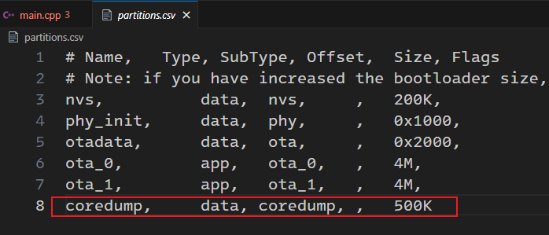
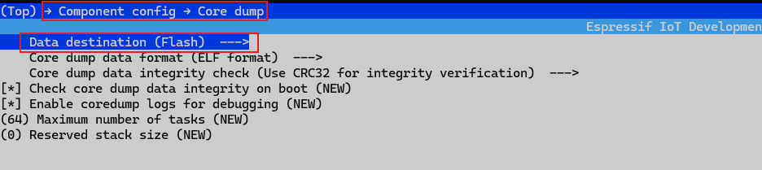
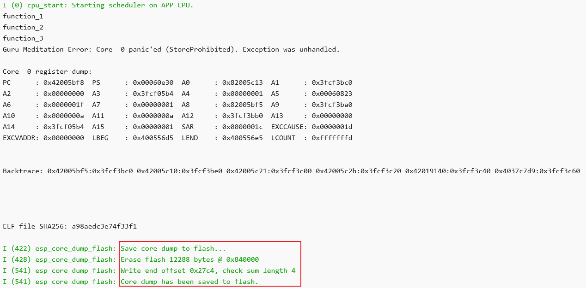
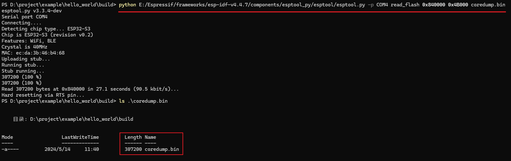

# 配置分区表

增加`coredump`分区

# 使能Coredump输出

`idf.py menuconfig`

# 程序运行输出

# Coredump分析

## 拉取Coredump文件

`python E:/Espressif/frameworks/esp-idf-v4.4.7/components/esptool_py/esptool/esptool.py -p COM4 read_flash 0x840000 0x4B000 coredump.bin`

## 解析Coredum文件

