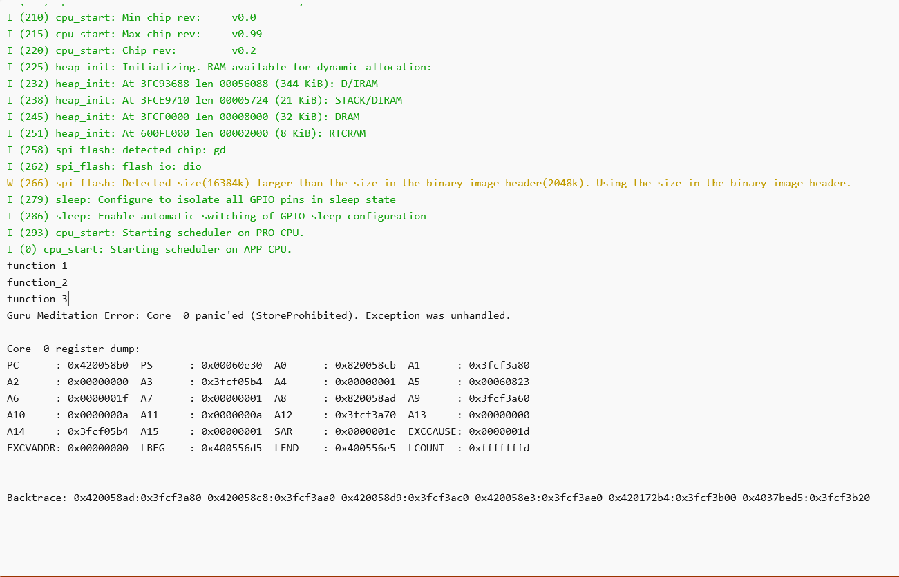
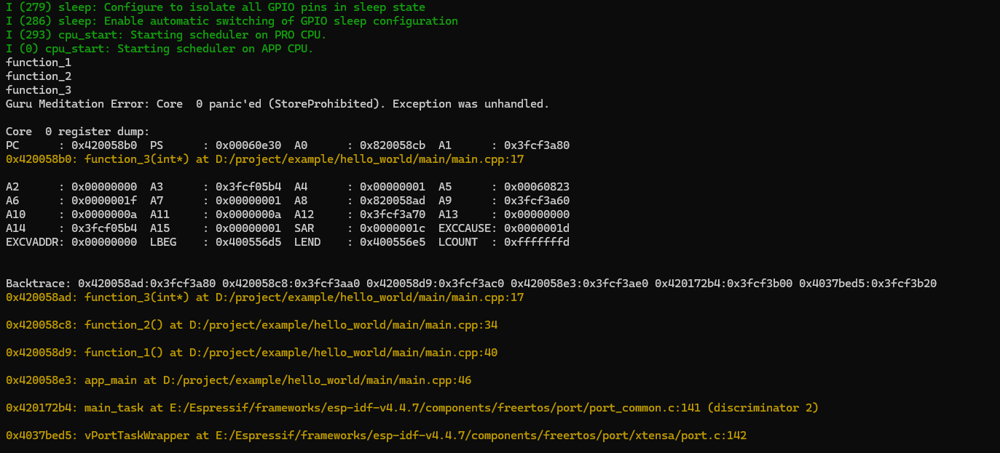
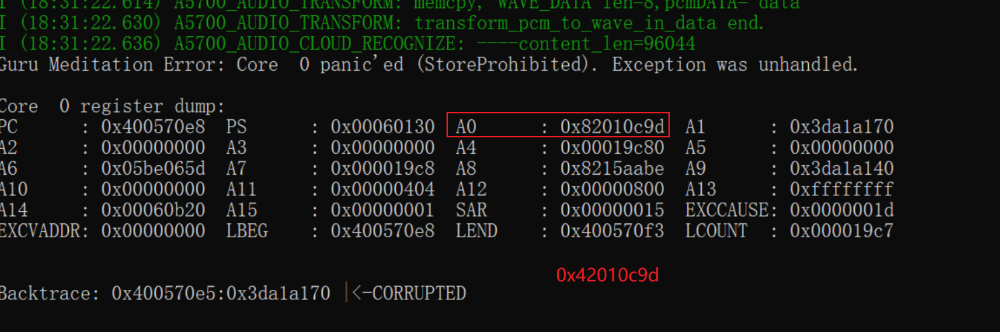

# 运行结果


## 普通串口




## 查看位置

```
Backtrace: 0x420058ad:0x3fcf3a80 0x420058c8:0x3fcf3aa0 0x420058d9:0x3fcf3ac0 0x420058e3:0x3fcf3ae0 0x420172b4:0x3fcf3b00 0x4037bed5:0x3fcf3b20
```

```
xtensa-esp32s3-elf-addr2line.exe -e main.elf 0x420058ad:0x3fcf3a80 0x420058c8:0x3fcf3aa0 0x420058d9:0x3fcf3ac0 0x420058e3:0x3fcf3ae0 0x420172b4:0x3fcf3b00 0x4037bed5:0x3fcf3b20
D:/project/example/hello_world/main/main.cpp:17
D:/project/example/hello_world/main/main.cpp:34
D:/project/example/hello_world/main/main.cpp:40
D:/project/example/hello_world/main/main.cpp:46
E:/Espressif/frameworks/esp-idf-v4.4.7/components/freertos/port/port_common.c:141 (discriminator 2)
E:/Espressif/frameworks/esp-idf-v4.4.7/components/freertos/port/xtensa/port.c:142
```


## idf monitor

`idf.py monitor`




# 特殊错误

`A0` 地址如果是 `0x8xxxxxxx` 转成为 `0x4xxxxxxx`， 分析地址所位置。



